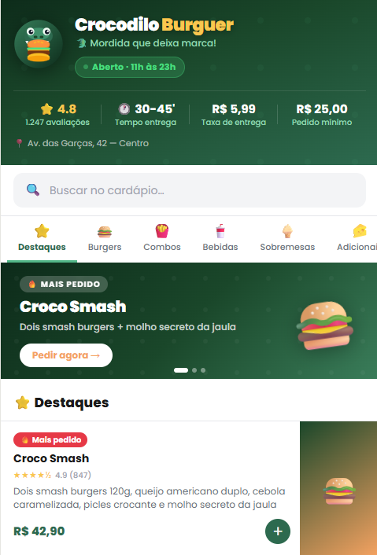
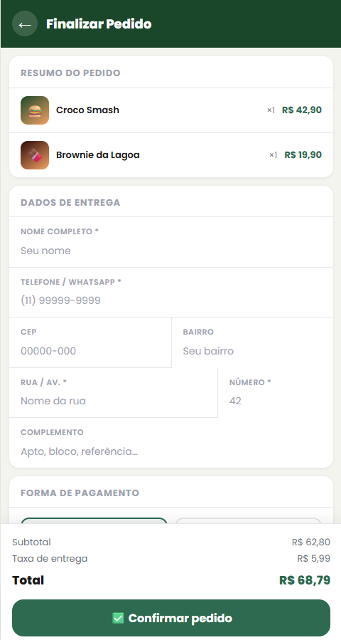
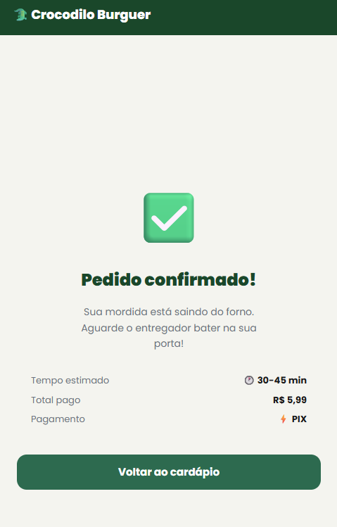
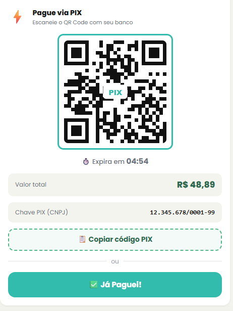
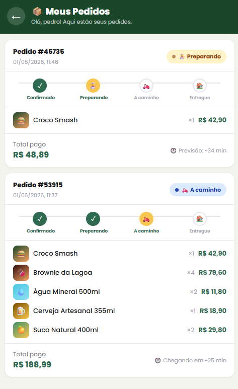

# 🐊 Crocodilo Burguer

> Cardápio digital mobile-first estilo Goomer — React, carrinho com persistência, checkout e animações. Sem backend.

🌐 **[Ver projeto ao vivo](https://crocodilo-burguer.vercel.app)** — Deploy na Vercel


---

## 📱 Sobre o projeto

Cardápio digital para a lanchonete fictícia **Crocodilo Burguer**, desenvolvido com foco em UI/UX mobile. A aplicação simula a experiência de um app de delivery real — com login, carrinho, checkout, pagamento via PIX e cartão, acompanhamento de pedidos em tempo real e muito mais. Tudo isso sem banco de dados, 100% front-end.

> **⚙️ Decisão técnica intencional:** toda a persistência de dados (carrinho, sessão de login, histórico de pedidos) é feita via `localStorage`. Essa escolha foi proposital para manter o projeto 100% front-end, sem necessidade de backend ou infraestrutura externa — ideal para demonstrar domínio de React, Context API e UX sem dependências extras.

---

## 📸 Screenshots

<div align="center">
  
  
  
  
  
  
</div>

---

## ✨ Funcionalidades

### 🏠 Interface & Navegação
| Feature | Descrição |
|---|---|
| 🐊 **Logo SVG** | Crocodilo com hambúrguer na boca, desenhado 100% em SVG puro |
| 🎠 **Banner promocional** | Carrossel auto-rotativo (4s) com 3 promoções e dots de navegação |
| 🔍 **Busca em tempo real** | Filtra produtos por nome e descrição instantaneamente |
| 📂 **Categorias sticky** | Nav fixa no topo com scroll-spy — destaca a categoria conforme a rolagem |
| 📱 **Mobile-first** | Layout max 480px idêntico ao Goomer no celular |

### 🛒 Cardápio & Carrinho
| Feature | Descrição |
|---|---|
| ⭐ **Avaliações** | Estrelas e contagem de reviews em todos os produtos |
| 🚀 **Animação voadora** | Emoji do produto voa até o carrinho ao clicar em adicionar |
| 📋 **Modal de produto** | Bottom sheet com hero, reviews de clientes e seletor de quantidade |
| 🛒 **Carrinho completo** | Adicionar, remover, ajustar quantidade, subtotal e taxa de entrega |
| 💾 **Persistência** | Carrinho salvo no `localStorage` — mantido ao fechar o navegador |

### 🦎 Cardápio Exótico
| Feature | Descrição |
|---|---|
| 🐊 **Yacaré Selvagem** | Blend de *Caiman crocodilus yacare* com queijo brie e maionese de tucupi |
| 🦆 **Pato Real** | Peito de pato confitado com camembert, geleia de laranja e brioche |
| 🐟 **Pirarucu da Amazônia** | Hambúrguer de pirarucu defumado na lenha com pão de tapioca artesanal |
| 🛡️ **Aviso legal animado** | Banner com ticker rolante, selo pulsante e texto oficial IBAMA/MAPA/SIF |

### 👤 Autenticação
| Feature | Descrição |
|---|---|
| 🔐 **Login / Cadastro** | Modal com abas, validação de campos e mensagens de erro claras |
| 👁️ **Mostrar/ocultar senha** | Toggle de visibilidade da senha |
| 🟡 **Avatar com inicial** | Exibe a inicial do nome do usuário logado no header |
| 💾 **Sessão persistente** | Usuário continua logado após fechar e reabrir o app |

### 💳 Checkout & Pagamento
| Feature | Descrição |
|---|---|
| 📝 **Formulário de entrega** | Nome, telefone, CEP, rua, número, bairro e complemento |
| ⚡ **PIX com QR Code** | QR Code gerado em SVG com countdown de 5 minutos e botão "Já Paguei!" |
| 📋 **Copiar código PIX** | Copia o código EMV para a área de transferência |
| 💳 **Cartão com bandeira** | Detecta Visa, Mastercard, Amex, Elo e Hipercard ao digitar |
| 🎴 **Preview do cartão** | Card visual animado que muda de cor conforme a bandeira detectada |
| 💵 **Pagamento em dinheiro** | Campo de troco opcional |
| ✅ **Tela de sucesso** | Confirmação com tempo estimado e resumo do pagamento |

### 📦 Acompanhamento de Pedidos
| Feature | Descrição |
|---|---|
| 📦 **Histórico de pedidos** | Lista todos os pedidos vinculados ao usuário logado |
| 🔄 **Status em tempo real** | Progresso automático: Confirmado → Preparando → A caminho → Entregue |
| ⏱️ **Stepper animado** | Indicador visual do passo atual com animação pulsante em amarelo |
| 🕐 **Previsão de entrega** | Tempo estimado atualizado automaticamente a cada 30 segundos |

---

## 🚀 Como rodar

### Pré-requisitos
- [Node.js](https://nodejs.org/) v18+

### Instalação

```bash
# Clone o repositório
git clone https://github.com/Pedroaruana/CrocodiloBurguer.git

# Entre na pasta
cd CrocodiloBurguer

# Instale as dependências
npm install

# Rode em modo desenvolvimento
npm run dev
```

Acesse: **http://localhost:5173**

### Ver no celular (mesma rede Wi-Fi)

```bash
npm run dev -- --host
```

Abra o IP que aparecer no terminal no navegador do celular.

---

## 🛠️ Tecnologias

- **React 18** — Componentes funcionais, hooks, Context API, useReducer
- **Vite 5** — Build tool e dev server ultrarrápido com HMR
- **CSS puro** — Custom properties, animações keyframe, mobile-first
- **LocalStorage** — Persistência de carrinho, sessão e histórico de pedidos
- **SVG** — Logo, QR Code PIX e bandeiras de cartão gerados programaticamente

---

## 👤 Autor

Feito com 🐊 por **Pedro Aruanã**
